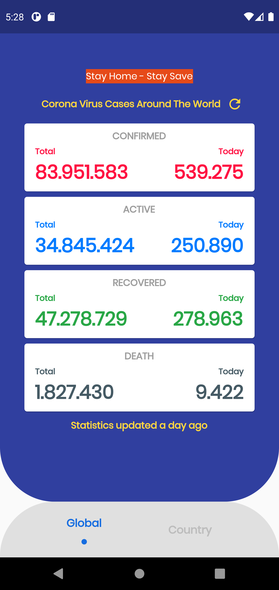
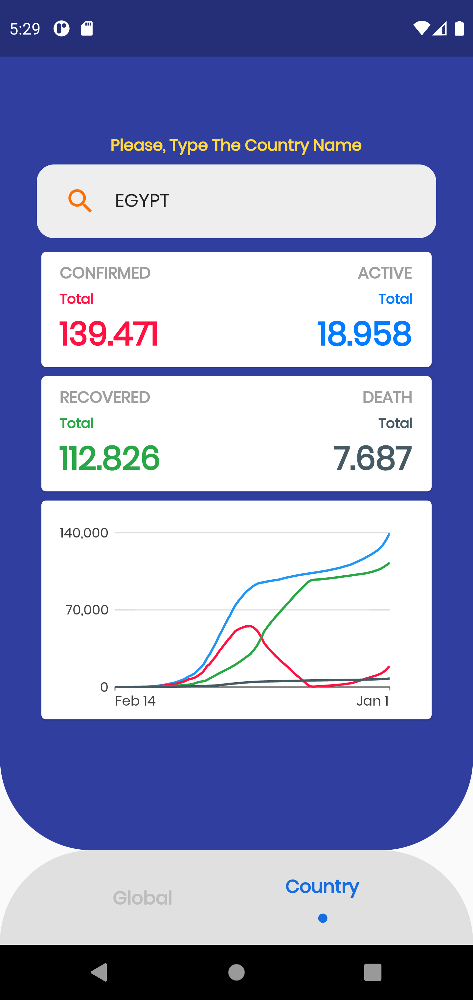
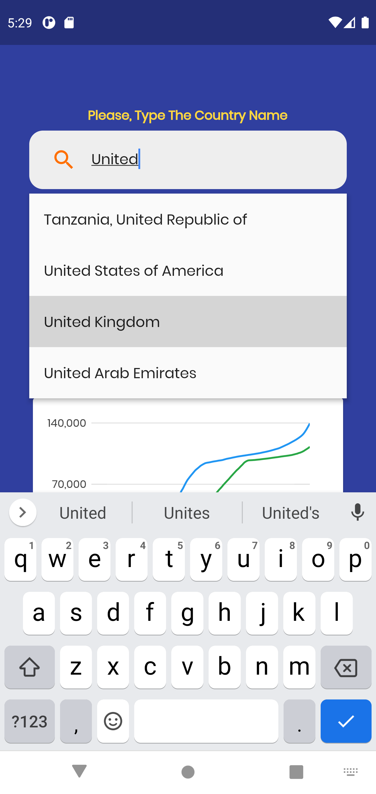
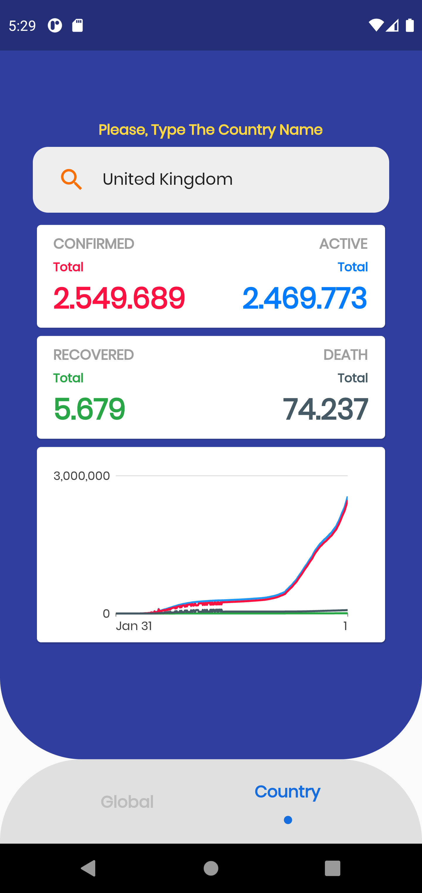

# CoronaVirus App

This is a Live Data Tracker Covid-19 App Using REST-API. Stay Home - Stay Safe

# Tools
- State Management (Provider)
- MVVM Design Pattern
- Charts Flutter
- Covid-19 API
- Google Fonts 
- Shimmer
- Flutter Typeahead
- Timeago

# Features
- Connecting With Database
- Retrieve Data From Database 
- Interacting With JSON API
- Show The Global Statistics 
- Search For Specific Country And See Its Statistics

# Screenshots 
There are Some Screenshots to Show How My App Looks.

